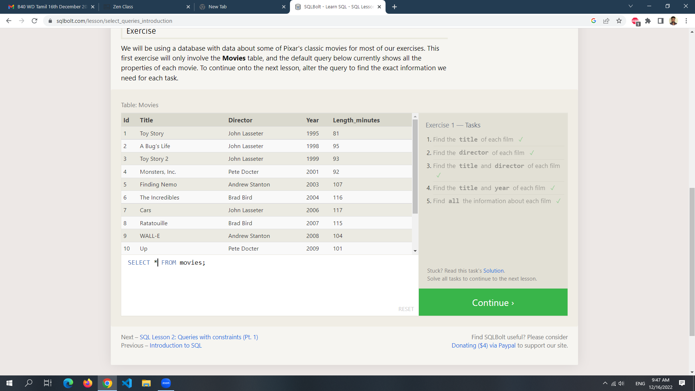
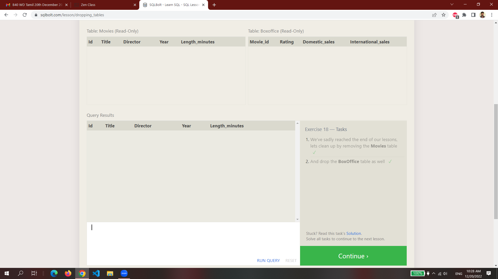

# sql-query
A collection of SQL practice solutions completed on SQLBolt
. This project contains executed query screenshots and solution files for different SQL lessons.

---

## 🚀 Features

- Step-by-step SQL queries 

- Screenshots of executed queries and results

- Beginner-friendly SQL learning resource

---

## 📂 Project Structure
sql-query/
├──sql
│ ├──1.png
│ ├──2.png
│ ├──3.png
│ ├──4.png
│ ├──5.png
│ ├──6.png
│ ├──7.png
│ ├──8.png
│ ├──9.png
│ ├──10.png
│ ├──11.png
│ ├──12.png
│ ├──13.png
│ ├──14.png
│ ├──15.png
│ ├──16.png
│ ├──17.png
│ ├──18.png

---

📥 Clone This Repository
# Clone the repo
```bash
git clone https://github.com/Elanthiran/sql-query.git
cd sql-query
```
---

## ▶️ Usage

- Open the screenshots/ or lesson folders to view executed queries.

- Refer to queries.sql (if added) to review the SQL solutions.

---

## 📸 Screenshots





---

## 🛠️ Tech Stack

- SQL (Structured Query Language)

- SQLite / SQLBolt Platform

---

## 🌱 Future Improvements

- Add explanations for each query

- Add advanced SQL practice exercises

---

## 🤝 Contributing

Contributions are welcome!


- Fork the repository

- Create a new branch (feature/new-solution)

- Commit your changes

- Push and create a Pull Request

--- 

## 📝 License

This project is licensed under the MIT License – feel free to use and share for learning purposes.
